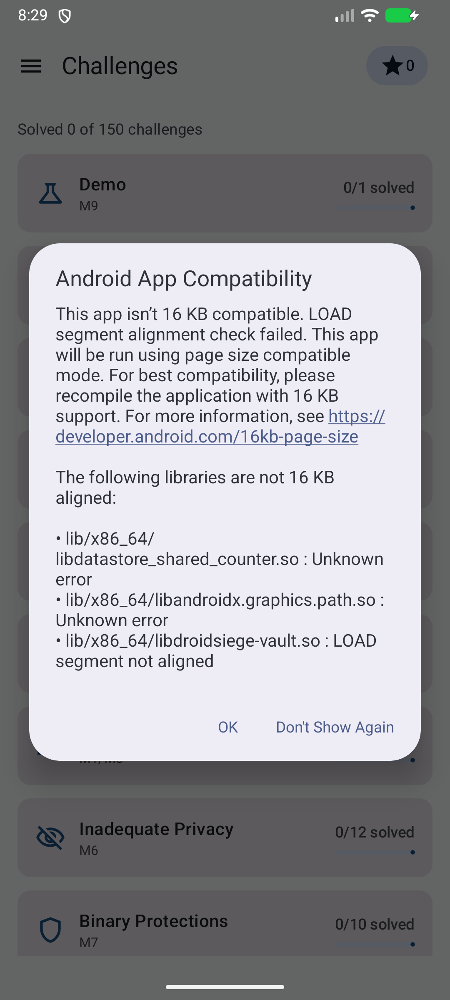

# 🏰 DroidSiege

An intentionally vulnerable Android app for learning mobile penetration testing —
**150 graded in-app challenges** across the OWASP Mobile Top 10 (2024) plus a **12-tier
insecure Ktor backend** for the server-side classes (BOLA, broken auth, mass assignment).

Every challenge ships **both paths**: the vulnerable behavior and the hardened fix — flip
the Secure/Insecure toggle and feel the difference. Every family has a full write-up with
exploit steps, flags, and a verified tooling pack.

| Legend | Meaning |
|---|---|
| 🟢 L1 EASY | first tool, first read |
| 🟡 L2 MEDIUM | one step deeper |
| 🟠 L3 HARD | chained or tool-assisted |
| 🔴 L4 INSANE | multi-step chains, bypasses |

**Start:** clone the repo, run `./gradlew :app:assembleDebug`, install on an emulator,
solve the Demo challenge, then pick a category. Stuck? Hints are in-app; full spoilers in
[docs/solutions/](solutions/).

⚠️ Educational use only. Never deploy the lab backend anywhere public.

